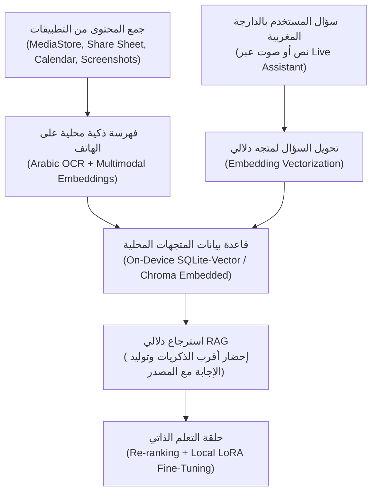

# معمارية وتفاصيل تطبيق «ذِكْرى» (Dhikra AI Architecture)

مستند تقني مفصل يشرح معمارية ومكونات تطبيق **«ذكرى»** كنظام مساعد ذاكرة محلي ذكي (Privacy-First On-Device AI) موجه للمستخدم المغربي والعربي.

---

## 1. المعمارية التقنية (The 4-Pillar Pipeline)

كما هو موضح في التصميم الهندسي للتطبيق:

### المرحلة 1: جمع المحتوى من التطبيقات (Ingestion Layer)
- **MediaStore API (Android)**: قراءة الصور، الفيديوهات ولقطات الشاشة الجديدة تلقائياً في الخلفية (`WorkManager`).
- **Android Share Sheet**: تمكين المستخدم من مشاركة أي رابط YouTube، ملاحظة، أو محادثة WhatsApp مباشرة لتطبيق «ذكرى».
- **Calendar Provider API**: استخراج مواعيد الطبيب، الاجتماعات، والمناسبات.

### المرحلة 2: الفهرسة الذكية المحلية (On-Device Intelligence)
- **OCR باللغة العربية**: استخدام Google ML Kit Text Recognition (Arabic Script) أو Tesseract On-Device بدون إرسال الصور لأي خادم سحابي.
- **تضمين المتجهات (Multimodal Embeddings)**:
  - للنصوص: نموذج مدمج محلياً مثل `sentence-transformers/paraphrase-multilingual-MiniLM-L12-v2` بصيغة ONNX Runtime Mobile.
  - للصور: نموذج MobileCLIP لتضمين الصور دلالياً (البحث بالمعنى، مثلاً البحث عن "حولي العيد" يجلب صورة عيد الأضحى).
- **قاعدة البيانات**: `sqlite-vss` أو `ObjectBox Vector Search` داخل الهاتف.

### المرحلة 3: استرجاع دلالي بالدارجة المغربية (Darija RAG Engine)
- **معالجة الدارجة**:
  - قاموس مرادفات مغربية موسع (طاجين = وصفة / طياب؛ رونديفو = موعد / طبيب؛ تصويرة = صورة؛ ريب = RIB / حساب بنكي).
  - حساب درجة التطابق عبر Cosine Similarity:
    $$\text{Similarity}(Q, M) = \frac{Q \cdot M}{\|Q\| \|M\|}$$
  - صياغة الإجابة المباشرة بالدارجة وربطها بالمصدر الأصلي والوقت الدقيق.

### المرحلة 4: حلقة التعلم الذاتي (Self-Learning Loop)
- تفاعل المستخدم (👍 / 👎) يقوم بتحديث أوزان إعادة الترتيب (Re-ranking Weights) محلياً على الجهاز ليتعلم التطبيق اهتمامات المستخدم وتفضيلاته مع الوقت.

---

## 2. مساعد الصوت المباشر (Live Voice Assistant Overlay)

مستوحى من التصميم المتقدم في الصورة الثانية:
- **Partager l'écran avec Live**:
  - يعتمد على `MediaProjection API` في أندرويد لأخذ لقطة شاشة لحظية وتحليل ما يراه المستخدم فوراً.
- **Floating Capsule UI**:
  - واجهة عائمة (`SYSTEM_ALERT_WINDOW`) تظهر فوق التطبيقات الأخرى.
  - تموجات صوتية تفاعلية تتجاوب مع نبرة صوت المستخدم (Waveform Visualizer).
  - زر ميكروفون دائري بالألوان الترابية المريحة للعين (Brown / Terracotta).
